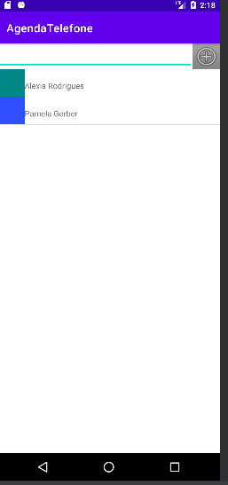
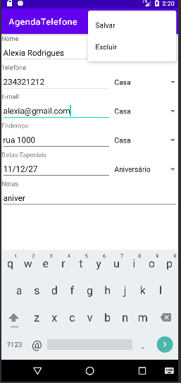
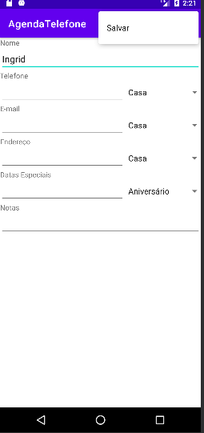
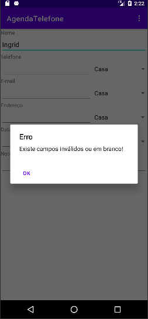

# Desenvolvimento- M2
Aplicativo para gerenciar contatos, banco de dados utilizado SQLite nativo do Android Studio.

# Capturas-Tela_Principal/Alterar_Excluir

  
  

# Capturas-Tela_Adicionar/Validação

  
  

